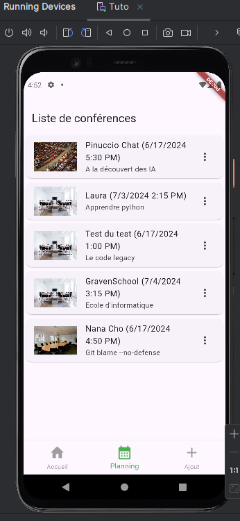
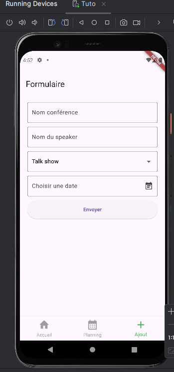

# First exercise with Android Studio and Flutter

## Introduction

This project is a starting point for Flutter application development. Following the Graven-Développement tutorial, I created my first basic app with Android Studio and Flutter. I built a site for Android and IOS that lists conferences and includes a form to add new ones. For the database, I used Firebase's Firestore.

Before starting, I installed:

- Flutter SDK
- Dart SDK
- Android Studio
- A Firebase account to use Firestore
